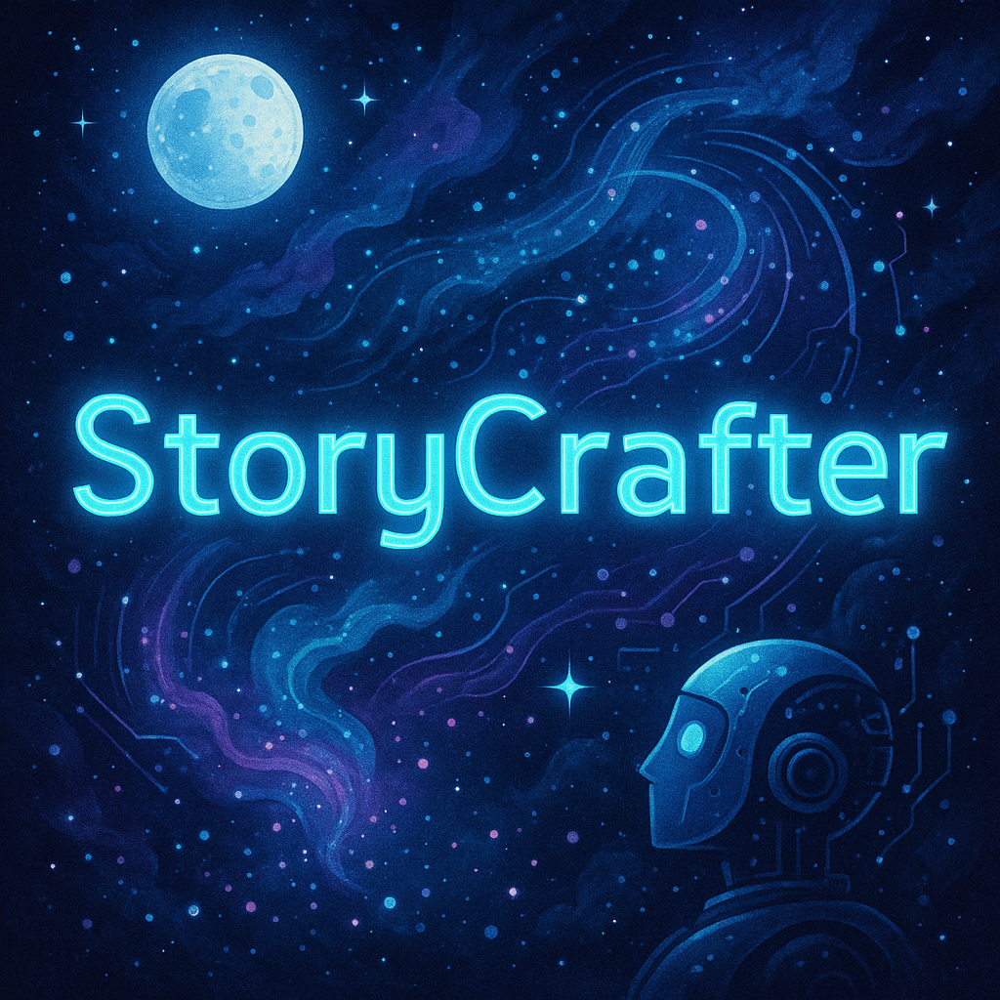

# StoryCrafter

**StoryCrafter** is an interactive storytelling application that generates unique stories based on user input, powered by AI.



## Features

- **Story Generation**: Generate a unique story based on the user’s prompt.
- **Interactive UI**: A user-friendly interface built with Streamlit.
- **AI-driven**: Uses Hugging Face’s transformer models for story creation.

## Technologies Used

- **Python**: Main programming language for backend logic.
- **Streamlit**: Framework for building the interactive user interface.
- **PyTorch**: Framework for AI model integration.
- **Transformers (Hugging Face)**: Pretrained models for story generation.

## 🛠️ Installation

Follow the steps below to set up and run the app on your local system:

1. **Clone the repository**
    ```bash
    git clone https://github.com/CaptainCode2024/StoryCrafter.git
    cd StoryCrafter
    ```

2. **Create and activate a virtual environment**
    ```bash
    python -m venv scenv
    scenv\Scripts\activate   # For Windows
    ```

3. **Install the dependencies**
    ```bash
    pip install -r requirements.txt
    ```

4. **Run the application**
    ```bash
    streamlit run SourceCode/app_streamlit.py
    ```

The app will launch in your default browser at `http://localhost:8501`.

