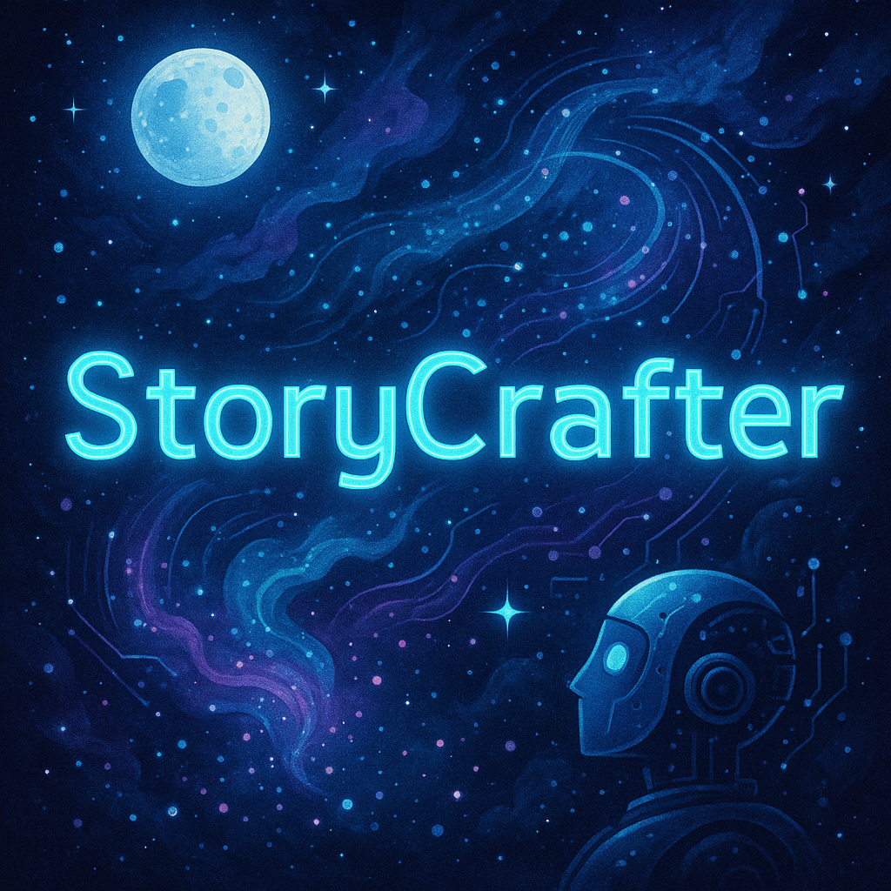

# StoryCrafter

**StoryCrafter** is an interactive storytelling application that generates unique stories based on user input, powered by AI.

## Features

- **Story Generation**: Generate a unique story based on the user’s prompt.
- **Interactive UI**: A user-friendly interface built with Streamlit.
- **AI-driven**: Uses Hugging Face’s transformer models for story creation.

## Technologies Used

- **Python**: Main programming language for backend logic.
- **Streamlit**: Framework for building the interactive user interface.
- **PyTorch**: Framework for AI model integration.
- **Transformers (Hugging Face)**: Pretrained models for story generation.
